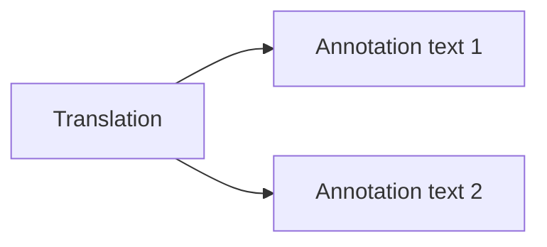
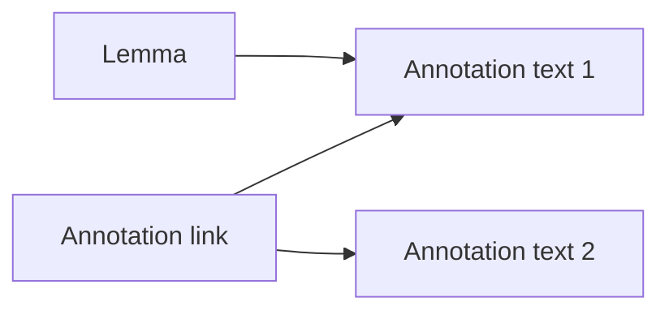

# Anotations

The annotation should be build up in a tree structure, so we can have one annotation that is part of one or multiple linked annotations.  
This gives us the freedom of reusing the same annotation for one text with different meanings and different metadata.

## Annotation examples

### Annotation that describes a translation



#### Translation Annotation
One annotation describes the relation between different annotattions, this can be f.e. a translation of a text in greek, english, .....

```json
{
  "id": "anno_translations",
  "target": [
    {
      "id": "anno_1",
      "language": "gr"
    },
    {
      "id": "anno_2",
      "language": "en"
    }
  ]
}
```

```json
{
  "id": "anno_1",
  "target": [
    {
      "id": "text_greek_1",
      "language": "gr"
    }
  ]
}
```

```json
{
  "id": "anno_2",
  "target": [
    {
      "id": "text_greek_2",
      "language": "gr"
    }
  ]
}
```

#### Annotation is linked multiple times
